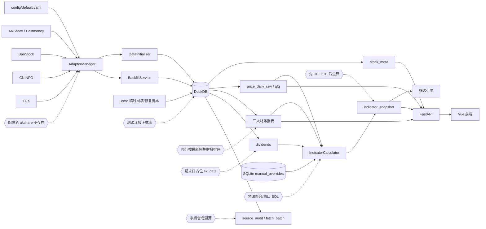

# 数据完整性红队终审报告 V2（2026-07-20）

> **Verdict: BLOCK**
>
> 审查对象：`value-dashboard` 当前源码、当前 DuckDB/SQLite 数据文件及现有测试体系  
> 证据时间：2026-07-20，Asia/Shanghai  
> 报告性质：当前状态终审、数据真实性与完整性专项调查  
> 历史基线：[`docs/10_RED_TEAM_AUDIT.md`](10_RED_TEAM_AUDIT.md)（2026-07-18）  
> 状态说明：本报告新增，不覆盖旧报告。旧报告保留为历史快照；当前状态以本报告为准。

---

## 1. 总体结论

当前交付物不能用于真实投资判断，也不能解除质量阻断。

项目并不是“所有数据都是随机生成的假数据”。历史价格、截至 2025-Q1 的 CSMAR 财务数据，以及一部分股票元数据具有真实数据基础。但真实数据与以下内容混合存储并被统一暴露给指标和页面：

1. 只包含少数字段、却按完整财务报表入库的 BaoStock 财务壳行；
2. 将报告期末当作除权日的分红占位数据；
3. 事后批量补写、没有原始响应哈希和真实批次关联的“溯源”记录；
4. 测试写入的筛选结果、人工覆写及长期停留在 `running` 状态的作业记录；
5. 无法成功执行的新指标计算链路，以及先清空正式快照再重算的非原子流程。

因此，系统目前同时存在两类风险：

- **错误值风险**：错误日期、壳行和错误语义可能生成误导性指标；
- **错误新鲜度风险**：表面上有 2026-Q1 财报日期，但核心字段为空，指标快照实际仍停留在 2025-Q1。

### 1.1 阻断验收的四个直接原因

| ID | 阻断原因 | 已复现事实 |
|---|---|---|
| DQ-01 | 指标计算 SQL 对任意股票失败 | `600519`、`000001`、`300750` 均抛出 DuckDB `BinderException` |
| DQ-02 | 快照重算先删除正式表，再执行长任务 | 审查中实际出现 `indicator_snapshot` 从 5,129 行变为 0 行 |
| DQ-03 | 最新财务记录是字段严重不完整的壳行 | 2026-Q1 资产负债表 3,556 行，资产/负债/权益/股本填充数全部为 0 |
| DQ-04 | 核心财务数据源配置引用不存在的适配器名 | 实测 `balance_sheet` 抓取 0 行，没有尝试任何已注册适配器 |

只要上述任一问题仍存在，验收结论都必须保持 `BLOCK`。

---

## 2. 审查范围、方法与证据标准

### 2.1 审查范围

本次调查覆盖：

- 数据源和适配器：`app/core/adapters/`
- 初始化、更新和回填：`app/core/init.py`、`app/core/update.py`、`app/core/backfill.py`、`.omo/run_*`、`.omo/fix_*`
- DuckDB/SQLite 存储与 schema：`app/core/storage/`
- 指标计算：`app/core/indicators/calculator.py`
- DSL 解析和 SQL 生成：`app/core/dsl/`
- 筛选、单股详情和数据状态 API：`app/core/screening/`、`app/web/api/`
- 前端数据消费：`frontend/src/`
- 测试与验收脚本：`tests/`
- 当前数据文件：`data/valuedashboard.duckdb`、`data/valuedashboard.sqlite`
- 快照归档：`data/archive_accept/indicator_snapshot.parquet`
- 历史报告：`docs/10_RED_TEAM_AUDIT.md`

### 2.2 审查方法

本报告使用四级证据：

1. **现库事实**：对当前 DuckDB/SQLite 执行只读聚合、覆盖率和一致性查询；
2. **源码事实**：读取数据流上的具体函数、SQL 和默认值；
3. **本地安全 PoC**：使用代表性股票或内存数据库复现，不调用外部网络；
4. **反证和降级**：对旧报告中的结论重新检查，已修复或证据不足的内容不继续作为当前问题报告。

### 2.3 严重度定义

| 级别 | 含义 |
|---|---|
| P0 / BLOCK | 当前核心功能不可用、存在已证实的数据丢失，或会系统性产生错误投资结论 |
| P1 / HIGH | 数据真实性、溯源或关键口径存在大范围错误，但影响面可限定 |
| P2 / MEDIUM | 局部数据缺口、潜在数据丢失路径、运维状态失真或测试可信度问题 |
| P3 / LOW | 不直接改变当前指标结果，但降低可维护性、可诊断性或未来正确性 |

### 2.4 局限性

- 当前目录不是 Git 仓库，无法使用提交历史判断问题引入时间；
- 没有调用外部行情或财务服务，未将当前数据逐项与外部真值源核对；
- 全量 `pytest` 与 `pytest --collect-only` 已证明会在导入阶段写正式数据库，因此没有再次运行；
- 前端完成了 `vue-tsc --noEmit`，但未做完整浏览器视觉回归；
- Ruff 未安装，Python/Vue LSP 不可用；
- 极端财务值没有外部真值证据时，不直接判定为错误，只列为后续异常检测对象。

---

## 3. 当前数据流与失真位置



### 3.1 数据源与当前用途

| 来源 | 预期用途 | 当前实际状态 |
|---|---|---|
| AKShare / Eastmoney | 股票列表、上市信息、价格、完整财务报表 | 注册名与配置名不一致，核心财务抓取路径实际失效 |
| BaoStock | 价格、分红补充 | 价格有大量历史数据；临时脚本还将指标行写入完整财务表 |
| CNINFO | 公告和分红真值补充 | 当前分红库没有公告日期，未体现真实除权日链路 |
| TDX | 行情、除权除息、财务备源 | `xdxr` 当前 0 行，未成为当前真值链路 |
| CSMAR 批量导入 | 截至 2025-Q1 的历史财务和分红 | 是完整财务字段的主要基础；分红日期使用报告期末占位 |
| `.omo` 脚本 | 一次性回填、修复、验收 | 多个脚本绕开正式批次和质量门禁，写入壳行和合成溯源 |

---

## 4. 当前数据库清单

证据采集时间：2026-07-20，Asia/Shanghai。

### 4.1 DuckDB 表统计

| 表 | 行数 | 股票代码数 | 日期范围或备注 |
|---|---:|---:|---|
| `stock_meta` | 5,528 | 5,528 | 行业一级字段填充 0 |
| `price_daily_raw` | 17,230,780 | 5,541 | 1990-12-19 至 2026-07-17 |
| `price_daily_qfq` | 16,890,310 | 5,200 | 1990-12-19 至 2026-07-17 |
| `balance_sheet` | 323,514 | 5,176 | 1990-12-31 至 2026-03-31 |
| `income_statement` | 323,691 | 5,176 | 1990-12-31 至 2026-03-31 |
| `cash_flow` | 309,304 | 5,129 | 1990-12-31 至 2025-03-31 |
| `dividends` | 44,883 | 4,979 | 1990-12-31 至 2024-12-31 |
| `indicator_snapshot` | 5,129 | 5,129 | 2024-09-30 至 2025-03-31 |
| `source_audit` | 15,649 | 5,541 | 仅 2 个逻辑批次 ID，均不能关联真实批次 |
| `fetch_batch` | 133 | 不适用 | 现有记录均为价格批次 |
| `xdxr` | 0 | 0 | 除权除息事件未落库 |

### 4.2 SQLite 状态

| 项目 | 数量 | 风险 |
|---|---:|---|
| `screening_results` | 4 | 其中 3 条严格等于测试数据 `600519 / name=test` |
| `manual_overrides` | 8 | 8 条均未回滚；计算器不检查发布状态 |
| `job_logs.status='running'` | 2 | 历史任务仍显示运行，运行态不可信 |
| `retry_list` | 0 | 与已知抓取/回填缺口不一致 |

### 4.3 表面新鲜度与字段新鲜度不一致

| 数据集 | 表面最新日期 | 核心字段实际覆盖 |
|---|---|---|
| 资产负债表 | 2026-03-31 | 3,556 行中资产、负债、权益、股本填充数均为 0 |
| 利润表 | 2026-03-31 | 3,601 行中营收仅 2；成本/营业利润/净利润/扣非净利润均为 0；只有归母净利润和 EPS 为 3,601 |
| 现金流量表 | 2025-03-31 | 2026-Q1 为 0 行 |
| 指标快照 | 2025-03-31 | 比价格数据晚约 16 个月，且当前代码无法重算 |

“最大报告日期”不能代表“最新完整财报日期”。

---

## 5. 发现汇总

| ID | 级别 | 类型 | 问题 | PoC 状态 | 修复阶段 |
|---|---|---|---|---|---|
| DQ-01 | P0 / BLOCK | 当前缺陷 | 分红摘要 SQL 非法，所有新指标计算失败 | 已复现 | Phase 0 |
| DQ-02 | P0 / BLOCK | 当前缺陷 | 快照先清空再长时间重算，失败后全表丢失 | 已实际发生 | Phase 0 |
| DQ-03 | P0 / BLOCK | 当前数据 | BaoStock 壳行被当作最新完整财报 | 现库确认 | Phase 0-1 |
| DQ-04 | P0 / BLOCK | 当前缺陷 | 配置引用不存在的 `akshare` 适配器名 | 已复现 | Phase 0 |
| DQ-05 | P1 / HIGH | 当前数据 | 分红日期为期末占位，公告日期全部缺失 | 现库确认 | Phase 1 |
| DQ-06 | P1 / HIGH | 当前数据 | `source_audit` 为事后合成记录 | 源码和现库确认 | Phase 1-2 |
| DQ-07 | P1 / HIGH | 当前数据 | 指标和现金流显著陈旧 | 现库确认 | Phase 1 |
| DQ-08 | P1 / HIGH | 当前缺陷 | 测试收集阶段写入正式数据库 | 已实际发生 | Phase 0 |
| DQ-09 | P2 / MEDIUM | 当前缺陷 | TTM API 和 DSL 函数名义与实际语义不符 | 已复现 | Phase 2 |
| DQ-10 | P2 / MEDIUM | 当前数据/缺陷 | raw/qfq 覆盖分裂，任务仍可报成功 | 现库确认 | Phase 2 |
| DQ-11 | P2 / MEDIUM | 当前数据/风险 | 行业、停牌和上市信息填充策略不可靠 | 现库与源码确认 | Phase 2 |
| DQ-12 | P2 / MEDIUM | 当前数据 | 测试结果、覆写和作业状态混入正式库 | 现库确认 | Phase 1-3 |
| DQ-13 | P2 / MEDIUM | 当前漂移 | 代码 schema 与现库 QFQ 列不一致 | 现库确认 | Phase 2 |
| DQ-14 | P2 / MEDIUM | 潜在风险 | 多条回填路径缺少显式事务和失败重试 | 源码确认 | Phase 1 |

## 6. 详细发现、影响与解决方案

### DQ-01：分红摘要 SQL 导致所有新指标计算失败

**级别：P0 / BLOCK**  
**状态：当前可复现缺陷**

#### 证据与 PoC

`app/core/indicators/calculator.py:333-348` 在聚合表达式中嵌入窗口函数：

```sql
SUM(CASE WHEN EXTRACT(YEAR FROM ex_date) =
                  EXTRACT(YEAR FROM MAX(ex_date) OVER ())
         THEN dividend_per_share ELSE 0 END) AS latest_dps
```

DuckDB 不允许聚合函数参数中包含窗口函数。对三只代表股票执行 `compute_all_for_stock`：

```text
600519 BinderException Binder Error: aggregate function calls cannot contain window function calls
000001 BinderException Binder Error: aggregate function calls cannot contain window function calls
300750 BinderException Binder Error: aggregate function calls cannot contain window function calls
```

影响路径：

```text
dividends
  -> _get_dividend_summary
  -> compute_all_for_stock
  -> compute_snapshot_for_all
  -> indicator_snapshot 无法重建
  -> 筛选和指标页面只能依赖旧快照
```

#### 根因与影响

查询将“查找最新分红年份”和“聚合该年度 DPS”压缩到同一层 SQL，没有遵守 DuckDB 的聚合/窗口约束。错误并非只影响分红指标：`compute_all_for_stock` 在计算任何股票时都会调用该函数，因此整个快照重算被阻断。

#### 最小修复

先用 CTE 求最新年份，再聚合：

```sql
WITH valid_dividends AS (
    SELECT ex_date, dividend_per_share
    FROM dividends
    WHERE stock_code = ?
      AND dividend_per_share IS NOT NULL
      AND dividend_per_share > 0
), latest AS (
    SELECT MAX(EXTRACT(YEAR FROM ex_date)) AS latest_year
    FROM valid_dividends
)
SELECT
    COUNT(*) AS total_records,
    COUNT(DISTINCT EXTRACT(YEAR FROM ex_date)) AS years_with_dividend,
    MAX(dividend_per_share) AS max_dps,
    AVG(dividend_per_share) AS avg_dps,
    SUM(dividend_per_share) AS total_dps,
    MAX(ex_date) AS latest_ex_date,
    SUM(CASE WHEN EXTRACT(YEAR FROM ex_date) = latest.latest_year
             THEN dividend_per_share ELSE 0 END) AS latest_dps
FROM valid_dividends
CROSS JOIN latest;
```

需要明确“同一年多次分红相加”的业务口径；无分红股票应返回结构化空值而不是异常。

#### 回归门禁

- 三只代表股票均能完成 `compute_all_for_stock`；
- 无分红、单次分红、同年多次分红、跨年分红四类测试通过；
- 全市场计算不再因 SQL 绑定错误失败。

---

### DQ-02：快照重算采用“先删后算”，已经造成全表丢失

**级别：P0 / BLOCK**  
**状态：已实际发生的数据丢失**

#### 证据与 PoC

`app/core/indicators/calculator.py:86-148` 在 `:115-117` 直接执行 `DELETE FROM indicator_snapshot`，随后逐股计算并通过 `_write_batch`（`:848-871`）分批写入。

`app/core/storage/duckdb_store.py:142-149` 的写上下文只负责锁、连接和关闭，没有为整次快照建立显式事务。

`tests/test_m2_snapshot.py:6-18` 又在模块导入时直接调用 `compute_snapshot_for_all()`。pytest 仅收集模块就会执行。审查中实际观察到：

- 开始时 `indicator_snapshot = 5,129`；
- 测试收集后变为 0；
- DQ-01 导致无法正常重建。

#### 影响

任意进程崩溃、SQL 异常、超时或中止，都可能让全市场指标和筛选瞬间消失。当前旧快照虽已恢复，代码路径仍未修复，问题可再次发生。

#### 解决方案

使用 staging 和原子发布：

1. 创建 `indicator_snapshot_staging_<run_id>`；
2. 所有计算结果只写 staging；
3. 验证股票数、必填列、唯一键、日期和失败率；
4. 在一个显式事务中替换正式表；
5. 成功后删除 staging；失败时保留旧表。

```sql
BEGIN TRANSACTION;
DELETE FROM indicator_snapshot;
INSERT INTO indicator_snapshot BY NAME
SELECT * FROM indicator_snapshot_staging;
COMMIT;
```

更稳妥的长期方案是版本化快照表与当前版本指针，发布只切换版本 ID。

#### 回归门禁

- 人为令第 100 只股票计算失败，正式表必须逐行不变；
- 成功发布后 staging 与正式表双向 `EXCEPT = 0`；
- `pytest --collect-only` 前后正式表计数和哈希不变。

---

### DQ-03：2025-Q2 至 2026-Q1 是“财务壳行”，却覆盖最新完整财报语义

**级别：P0 / BLOCK**  
**状态：当前现库事实**

#### 证据

`.omo/run_financial_backfill.py:1-9` 明确说明 BaoStock 返回指标级字段而非完整报表。脚本仍执行：

- `:91-113` 将归母净利润、营收和 EPS 写入 `income_statement`；
- `:116-138` 将债务率、流动比率、速动比率只放进 `raw_data`，同时在 `balance_sheet` 创建正式报告期行；
- 没有写入现金流量表。

2026-Q1 现库覆盖：

| 表 | 行数 | 核心字段覆盖 |
|---|---:|---|
| `balance_sheet` | 3,556 | 资产、负债、权益、股本均为 0/3,556 |
| `income_statement` | 3,601 | 营收 2；成本、营业利润、净利润、扣非净利润均为 0；归母净利润和 EPS 各 3,601 |
| `cash_flow` | 0 | 无数据 |

`app/core/indicators/calculator.py:157-192` 按 `bs.report_date DESC LIMIT 1` 选最新资产负债表，再连接同报告期利润和现金流。对于茅台，2026-Q1 最新行的资产、负债、权益全部为空。

#### 影响

- 最大日期使更新检查误判为成功；
- 估值、市值、ROE、ROA、负债率和现金流指标无法由最新行计算；
- 完整 CSMAR 行和不完整 BaoStock 行共享相同表和主键语义；
- 指标只能为空、退化或继续展示 2025-Q1 旧快照。

#### 根因

临时脚本将“财务指标观察”错误建模成“完整财务报表”，并使用 `INSERT OR REPLACE` 写正式表。系统没有完整度等级、字段集合约束、来源强约束和发布门禁。

#### 解决方案

1. 隔离所有 `raw_data.source='baostock'` 且核心字段不完整的财务行；
2. 先导出隔离 Parquet，不直接删除；
3. 将 BaoStock 比率迁移到专用 `financial_ratio_observation` 表；
4. 通过有效适配器抓取完整三大表；
5. 设置每类报表的必填字段阈值，低于阈值不得入正式表；
6. “最新完整报告期”按完整度和日期共同选择。

建议模型：

```sql
CREATE TABLE financial_ratio_observation (
    stock_code VARCHAR NOT NULL,
    report_date DATE NOT NULL,
    source VARCHAR NOT NULL,
    debt_ratio DOUBLE,
    current_ratio DOUBLE,
    quick_ratio DOUBLE,
    parent_net_profit DOUBLE,
    eps_ttm DOUBLE,
    confidence VARCHAR NOT NULL,
    fetch_batch_id VARCHAR,
    PRIMARY KEY (stock_code, report_date, source)
);
```

#### 回归门禁

- 新资产负债表必须满足资产、负债、权益完整口径；
- 利润表不能只有归母净利润/EPS 就标记完整；
- 现金流缺失时不得宣称整套财报已更新；
- `data status` 同时显示最新记录日期和最新完整日期。

---

### DQ-04：核心适配器配置名不匹配，真实财务抓取链被短路

**级别：P0 / BLOCK**  
**状态：当前可复现缺陷**

#### 证据与 PoC

`config/default.yaml:20-29` 将核心主源写为 `akshare`。`app/core/adapters/manager.py:25-60` 用配置替换默认链，没有规范化别名或追加备源。实际注册名为 `akshare_eastmoney`。

```text
priority = ['akshare']
registered = ['akshare_eastmoney', 'baostock', 'cninfo', 'tdx']
fetch(balance_sheet, 600519):
  rows = 0
  source = local_cache
  confidence = missing
  tried = []
  raw hash length = 0
```

#### 影响

- 初始化和更新无法通过预期主源抓取完整财报；
- 默认备源链被覆盖，连 `tdx` 也不会尝试；
- `local_cache/missing` 容易被误解为合法空数据；
- 空哈希违反溯源契约。

#### 解决方案

在配置边界规范化名称并拒绝未知值：

```python
ADAPTER_ALIASES = {"akshare": "akshare_eastmoney"}
```

```yaml
primary:
  balance_sheet: [akshare_eastmoney, tdx]
  income_statement: [akshare_eastmoney, tdx]
  cash_flow: [akshare_eastmoney, tdx]
  price_daily: [baostock, tdx, akshare_eastmoney]
  listing_info: [akshare_eastmoney]
```

应用启动时校验所有配置名已注册；未知名称应阻止启动，而不是静默返回缺失。

#### 回归门禁

- 未知适配器配置使启动失败；
- `fetch(balance_sheet, 600519)` 至少尝试一个已注册适配器；
- 主源失败后按顺序尝试备源；
- 失败结果也有合法哈希或明确的不可哈希原因类型。

---

### DQ-05：分红除权日为报告期占位，日期型股东回报指标不可信

**级别：P1 / HIGH**  
**状态：当前现库事实**

#### 证据

44,883 条分红记录中：

- `announcement_date` 填充 0；
- `ex_date` 只有 65 个不同日期；
- 42,717 条为 12 月 31 日；
- 2,166 条为 6 月 30 日；
- 100% 落在财务报告期末。

`app/core/indicators/calculator.py:333-348` 按 `ex_date` 判断最新分红年和 DPS，`:646-673` 计算分红率和连续分红年数。

#### 影响

- 最新分红年度、连续分红年数和年度 DPS 可能错误归年；
- 分红率、股息率及筛选条件失真；
- 无公告日期，不能判断预案、实施公告或已执行状态；
- 用户无法追溯真实除权日。

#### 解决方案

1. 将当前日期迁移到 `report_period`，未知 `ex_date` 保存 `NULL`；
2. 使用结构化分红源，或解析并验证实施公告/PDF；
3. 保存公告 ID、PDF 哈希、实施状态、来源批次；
4. 真实日期回填前暂停依赖日期的分红筛选，或标记不可用；
5. 不得把公告日或报告期当作真实除权日并标记严格可信。

#### 回归门禁

- 公告日和真实除权日可追溯；
- 日期不再集中于 65 个期末日；
- 抽样股票与公告一致；
- 未知日期返回 `NULL + reason_code`。

---

### DQ-06：`source_audit` 是事后合成计数，不是真实字段级溯源

**级别：P1 / HIGH**  
**状态：当前现库事实**

#### 证据

15,649 行 `source_audit` 中：

- 15,649 行哈希全部为空或长度不是 64；
- 15,649 行全部无法关联 `fetch_batch`；
- 只有 `backfill_v8` 和 `csmar_import` 两个逻辑批次 ID；
- 字段名主要是 `__price_count__`、`__balance_count__`、`__dividend_count__`。

`.omo/fix_p0_08_audit.py:1-37` 执行事后 `INSERT ... SELECT COUNT(*)`，并硬编码来源、版本、批次和空哈希。

#### 影响

页面看似“有溯源”，却无法还原原始响应、字段映射和污染批次，制造虚假可信感。

#### 解决方案

1. 将现有记录标为 `synthetic_summary` 并从字段级审计视图排除，或备份后删除；
2. 只允许真实抓取流程创建 `source_audit`；
3. 每次抓取先创建唯一 `fetch_batch`，保存真实 SHA-256、源版本、请求参数和日期范围；
4. CSMAR 导入保存原文件哈希、数据集版本、映射版本和原始行定位；
5. 无溯源数据应诚实显示 `missing lineage`。

#### 回归门禁

```sql
SELECT COUNT(*)
FROM source_audit s
LEFT JOIN fetch_batch f ON s.fetch_batch_id = f.batch_id
WHERE f.batch_id IS NULL;
```

必须为 0；抽样哈希必须能由归档原文重算。

---

### DQ-07：现金流和指标快照陈旧，数据日期展示误导

**级别：P1 / HIGH**  
**状态：当前现库事实**

#### 证据

- 原始/QFQ 价格更新至 2026-07-17；
- 资产负债表/利润表表面日期为 2026-03-31，但为壳行；
- 现金流仅至 2025-03-31；
- 指标快照仅至 2025-03-31。

茅台接口显示：

```text
indicator_report_date = 2025-03-31
latest_price_date = 2026-07-17
```

#### 影响与解决方案

价格与财务指标时点相差约 16 个月，现金流相关估值不能反映最新报告。每个指标应保存并展示 `financial_effective_date`、`price_date`、`calculated_at` 和 `data_version`。现金流落后时相关指标返回 `NULL + stale_reason`；快照超过阈值时阻止筛选或显著警告。

#### 回归门禁

- 每个指标都能追溯明确价格和财务日期；
- 壳行不能成为最新完整财务；
- 现金流缺失时不能显示有效现金流指标。

---

### DQ-08：测试收集会执行正式任务并写生产数据库

**级别：P1 / HIGH**  
**状态：已实际发生**

#### 证据

`tests/conftest.py:15-22` 直接连接默认正式 DuckDB。`tests/test_m2_snapshot.py:6-18` 在模块顶层执行：

```python
Config.load()
calc = IndicatorCalculator()
report = calc.compute_snapshot_for_all()
```

现有 `tests/test_p0_fixes.py:72-83,112-134` 还引用过期符号：`DSLCodegen`、`DSLParser`、`IndicatorCalculator._calc_ttm`。定向运行结果为 10 通过、3 失败。

#### 影响

- 运行或收集测试会修改正式数据；
- 测试不可重复，结果依赖正式库当前状态；
- 顶层 `print("PASS")` 可形成虚假通过；
- 测试工件混入正式 SQLite。

#### 解决方案

1. 所有测试使用 `tmp_path` 下的独立 DuckDB/SQLite；
2. 通过依赖注入传入数据库路径；
3. 禁止模块顶层执行任务；
4. 真实数据测试标记 `integration` 并使用只读副本；
5. 测试环境若路径指向项目 `data/`，立即失败；
6. 输出型脚本移出 `tests/`；
7. 修复过期符号和无效断言。

#### 回归门禁

- `pytest --collect-only` 前后正式库校验和不变；
- 全量测试可在空临时目录独立运行；
- 测试失败不留下备份、计划、覆写、作业或筛选结果。

### DQ-09：TTM API 和 DSL 函数返回错误语义

**级别：P2 / MEDIUM**  
**状态：当前可复现缺陷**

#### 证据

`app/web/api/stock_detail.py:209-306` 对 `period='ttm'` 执行 `pass`，随后与年度查询共用只取 12 月报告的 SQL。茅台 PoC：

```text
annual_count = 5
ttm_count = 5
annual trend == ttm trend: True
last report_date = 2025-12-31
```

`app/core/dsl/codegen.py:23-38` 的当前生成结果为：

```text
YoY(revenue) -> LAG(revenue, 4)
QoQ(revenue) -> LAG(revenue, 1)
TTM(revenue) -> revenue
```

它们返回旧值或原值，并非同比增长率、环比增长率或滚动十二个月值。

#### 影响

趋势页面把年度值标记为 TTM；DSL 用户得到数值类型正确但业务含义错误的结果。此类错误通常不触发异常，比显式失败更难发现。

#### 解决方案

- TTM 基于单季度或累计口径正确换算；
- YoY 计算 `(current - prior_year) / ABS(prior_year)`；
- QoQ 先确认字段为单季度还是累计值；
- 累计字段的 TTM 使用“最近年报 + 当前累计 - 去年同期累计”；
- AST 强制携带 `period_type`；
- 尚未实现的口径返回 422/501，不能返回伪结果。

#### 回归门禁

用人工构造的四季度数据验证公式；annual 与 TTM 在非年末时必须不同，除非输入事实确实相同。

---

### DQ-10：raw/qfq 覆盖缺口和历史范围分裂被“成功”状态掩盖

**级别：P2 / MEDIUM**  
**状态：当前数据问题 + 当前代码缺陷**

#### 证据

- raw：5,541 个代码；qfq：5,200 个代码；
- 341 个 raw 代码完全没有 qfq；
- 已确认其中 328 个为 BSE，13 个不在 `stock_meta`；
- `000560`、`600062`、`600085`、`600714` 的行数或结束日期严重分裂。

`app/core/backfill.py:109-264` 只把 raw 作为主要失败判断。qfq 为空时不会删除旧 qfq，也不会把股票计为失败，最后仍执行 `success += 1`。

#### 影响

用户切换 raw/qfq 时可能看到不同历史长度；回测、收益率和均线口径不一致；运维报告可显示成功而 qfq 缺失或陈旧。

#### 解决方案

- raw 和 qfq 分别记录成功/失败/缺失；
- BSE 不支持 qfq 时记录明确豁免原因；
- qfq 异常时不得保留旧数据并标记整体成功；
- 增加日期范围、交易日交集和复权连续性检查；
- 13 个孤儿代码先确认是否退市，再归档或清理。

#### 回归门禁

- 非豁免代码的 raw/qfq 最新交易日一致；
- 不支持市场有明确原因；
- 不允许 `success` 且 qfq 缺失原因为空。

---

### DQ-11：股票元数据以错误默认值代替未知状态

**级别：P2 / MEDIUM**  
**状态：当前数据问题 + 潜在覆盖风险**

#### 证据

`stock_meta` 5,528 行中：`sw_level1` 填充 0，停牌 True 为 0，停牌 NULL 为 0，ST True 为 211。

`app/core/init.py:108-155` 只抓 `stock_list`，并使用：

```python
"listing_date": row.get("listing_date"),
"is_st": row.get("is_st", False),
"is_suspended": row.get("is_suspended", False),
```

随后 `INSERT OR REPLACE`。而 `app/core/adapters/akshare_adapter.py:293-380` 的 `listing_info` 才包含更丰富信息，并用 `None` 表示停牌未知。

#### 影响

未知停牌被当作未停牌；行业排名和筛选不可用；重跑股票全集可能用空值/False 覆盖已回填值。旧报告“所有 listing_date 都是假”的结论本次证据不足，不能继续沿用。

#### 解决方案

- 合并 `stock_list` 与 `listing_info` 后写入；
- 未知布尔值保存 NULL；
- 使用字段级 UPSERT，新值为空时保留旧值；
- 建设行业数据源和版本；
- 记录字段来源、时间和置信度。

#### 回归门禁

- 远端停牌状态不可用时，入库值必须为 NULL 而非 False；
- 重跑股票全集后，已有非空上市日期和行业字段不得被空值覆盖；
- 行业排名只对具有同版本行业分类的股票计算。

---

### DQ-12：测试数据、人工覆写和作业状态混入正式 SQLite

**级别：P2 / MEDIUM**  
**状态：当前现库事实**

#### 证据

- 4 条筛选结果中，3 条严格为：

```json
[{"stock_code": "600519", "name": "test"}]
```

- 8 条 `manual_overrides` 均未回滚；
- 2 条历史 `job_logs` 仍为 `running`；
- `retry_list` 为 0。

`app/core/indicators/calculator.py:199-215` 读取覆写时只检查 `rolled_back_at IS NULL`，不检查是否已发布，也没有冲突顺序。草稿、预览和测试覆写可能参与计算。

#### 影响

筛选历史含假结果；同字段多条覆写的最终生效顺序不明确；作业状态不能反映进程是否存活；retry 机制没有承接已知失败。

#### 解决方案

- 清理前先导出并由数据所有者确认；
- 只有 `published` 且未撤销的覆写可参与计算；
- `(stock_code, field_name, report_date)` 只允许一个当前生效版本；
- 增加发布人、时间、证据和版本；
- 作业使用 heartbeat，超时转为 `abandoned/failed`；
- 抓取失败进入 retry，合法空结果单独分类。

> 本次审查只删除了审查过程自身精确创建的工件；既有 3 条假筛选结果和 8 条覆写没有擅自删除。

#### 回归门禁

- 草稿、预览和已撤销覆写均不得改变指标结果；
- 同字段存在多个 published 版本时必须拒绝发布或明确选出唯一当前版本；
- 作业进程结束或 heartbeat 超时后不得继续显示 `running`；
- 受控抓取失败必须生成 retry 记录。

---

### DQ-13：代码 schema 与当前 DuckDB schema 漂移

**级别：P2 / MEDIUM**  
**状态：当前现库事实**

`app/core/storage/schema.py:53-64` 声明 `price_daily_qfq.turnover_rate`，当前数据库实际没有该列；`app/web/api/stock_detail.py:95-104` 仍按“qfq 表没有 turnover_rate”查询。

#### 影响与解决方案

新建库与现有库结构不同，后续写入可能失败。应为 DuckDB 增加版本化迁移，不依赖 `CREATE TABLE IF NOT EXISTS` 更新旧表；明确 QFQ 是否需要换手率并统一 schema、写入和 API。CI 必须覆盖“新建库”和“旧库升级”两条路径。

#### 回归门禁

- 从空库初始化和从当前库升级后，`DESCRIBE price_daily_qfq` 必须一致；
- 迁移重复执行不改变 schema 或数据；
- API、适配器和表定义对 `turnover_rate` 的存在性保持一致。

---

### DQ-14：回填写入缺少事务边界和可靠失败记录

**级别：P2 / MEDIUM**  
**状态：潜在风险；快照路径已实际发生**

#### 证据

- `app/core/storage/duckdb_store.py:142-149` 不自动开启/回滚显式事务；
- `app/core/backfill.py:198-243` 对价格执行 DELETE 后 INSERT；
- `app/core/backfill.py:266-345` 分红失败和空 `ex_date` 直接跳过，不写 retry；
- 多个 `.omo` 脚本逐股票写正式库，绕过统一批次和门禁。

#### 影响与解决方案

中途异常可能留下半更新状态，失败计数和真实缺失不一致，数据无法按批次回滚。应提供异常自动回滚的 `transaction()`，采用 staging + validation + publish，为每个数据类型统一写 `fetch_batch` 和 retry，并禁止临时脚本绕开正式服务层。

#### 回归门禁

- 在 DELETE 后、INSERT 中途和批次发布前分别注入异常，正式数据必须保持原样；
- 每次失败均有唯一批次、错误分类和 retry 记录；
- 合法空结果与抓取异常在统计和熔断行为上可区分。

---

## 7. 修复路线图

### Phase 0：解除立即阻断

**目标**：指标计算、测试和实时抓取不再破坏或误写正式数据。  
**工作量等级**：M  
**前置条件**：冻结所有回填、快照重算和测试写入。

任务：

1. 修复 DQ-01 分红摘要 SQL；
2. 快照改为 staging + 原子发布；
3. 测试数据库完全隔离，移除模块顶层执行；
4. 修复适配器别名和启动配置校验；
5. 创建正式库备份和数据文件哈希。

**退出条件**：G01-G06 全部通过。

### Phase 1：清理并重建数据地基

**目标**：消除壳行、占位日期和伪溯源。  
**工作量等级**：L  
**依赖**：Phase 0 完成。

任务：

1. 隔离 BaoStock 壳行，迁移比率到专用表；
2. 补齐完整三大报表和现金流；
3. 回填真实分红实施日期和公告证据；
4. 删除或显式降级合成 `source_audit`；
5. 重建真实抓取批次和字段级溯源。

**退出条件**：G07-G13 全部通过。

### Phase 2：统一口径与跨表完整性

**目标**：相同名称在 API、DSL、数据库和页面中具有同一语义。  
**工作量等级**：M

任务：修复 TTM/YoY/QoQ；对齐 raw/qfq；完成 schema migration；建设行业、停牌和上市信息数据流。

**退出条件**：G14-G18 全部通过。

### Phase 3：清理个性化数据和运维状态

**目标**：正式 SQLite 不再混入测试工件或无效运行态。  
**工作量等级**：S-M

任务：导出并人工确认 3 条假筛选结果和 8 条覆写；建立覆写发布状态；关闭陈旧任务；让失败真实进入 retry。

**退出条件**：G19-G21 全部通过。

### Phase 4：持续质量门禁

**目标**：同类问题不能再次进入正式数据。  
**工作量等级**：M

建设每日质量报告、映射版本监控、财务恒等式与覆盖率检测、版本回滚演练、前端日期/置信度展示和数据源 contract tests。

## 8. 建议的数据清理与重建流程

> 本节除“审查副作用恢复”外均为**建议操作，尚未执行**。执行前必须创建新备份，并在副本上演练。

### Step 0：停止写入并建立证据快照

1. 停止 Web、回填和计划任务；
2. 确认没有 Python 写进程；
3. 复制 DuckDB/SQLite；
4. 导出表计数、schema 和文件 SHA-256；
5. 记录当前数据版本。

```powershell
Copy-Item "data\valuedashboard.duckdb" "data\backup\pre_rebuild.duckdb"
Copy-Item "data\valuedashboard.sqlite" "data\backup\pre_rebuild.sqlite"
Get-FileHash "data\valuedashboard.duckdb" -Algorithm SHA256
Get-FileHash "data\valuedashboard.sqlite" -Algorithm SHA256
```

**回滚**：停止进程后恢复文件副本。  
**运行时间**：取决于约 2GB DuckDB 的本地磁盘速度，不在本报告中承诺具体分钟数。

### Step 1：在副本中识别并隔离壳行

先导出，不直接删除：

```powershell
New-Item -ItemType Directory -Path "data\quarantine" -Force
```

```sql
COPY (
  SELECT * FROM balance_sheet
  WHERE CAST(raw_data AS VARCHAR) LIKE '%"source":"baostock"%'
    AND total_assets IS NULL
    AND total_liabilities IS NULL
    AND total_equity IS NULL
) TO 'data/quarantine/balance_shell_rows.parquet' (FORMAT PARQUET);
```

对利润表使用相应必填字段条件。导出后核对行数和 SHA-256，再在显式事务中隔离。

**回滚**：从隔离 Parquet 按主键恢复。  
**禁止事项**：不要按“报告日期大于 2025-Q1”直接删除，因为可能存在个别真实完整行。

### Step 2：重建完整财务表和真实溯源

1. 修复适配器配置；
2. 创建 staging 财务表；
3. 抓取完整报表；
4. 写入真实 `fetch_batch`；
5. 校验必填字段、主键、报告类型和来源哈希；
6. 原子发布。

不得继续使用 `.omo/run_financial_backfill.py` 当前写法回填完整报表。

### Step 3：重建真实分红事件

1. 当前记录导出为历史隔离数据；
2. 从结构化源或已验证实施公告重建；
3. 未知日期保持 NULL；
4. 校验公告、除权日、每股金额和实施状态；
5. 发布后重新计算分红类指标。

不得将 12-31/06-30 批量替换成推测日期。

### Step 4：重建指标快照

仅在 DQ-01 和 DQ-02 修复后执行：

1. 计算到 staging；
2. 验证候选股票数、失败列表和关键字段覆盖；
3. 与旧快照生成差异报告；
4. 事务发布；
5. 保存新快照版本和输入批次集合。

```sql
SELECT COUNT(*) FROM indicator_snapshot_staging;
SELECT COUNT(*) FROM indicator_snapshot;

SELECT COUNT(*) FROM (
  SELECT * FROM indicator_snapshot_staging
  EXCEPT
  SELECT * FROM indicator_snapshot
);
```

**回滚**：保留上一版本快照或在事务失败时不切换版本指针。

### Step 5：清理 SQLite 测试工件

必须先导出并让数据所有者确认。依据可验证测试标识删除，不按模糊标题批量删除。

人工覆写逐条确认：

- 是否有真实证据；
- 是否为 `published`；
- 是否与同字段其他覆写冲突；
- 是否保留历史但撤销当前生效状态。

### Step 6：全链路复验

- 对至少 30 只覆盖 SSE、SZSE、BSE、ST、无分红、亏损和新股的样本执行端到端验证；
- 将关键财务字段与独立外部来源人工抽样比对；
- 保存验证报告和数据版本；
- 全部门禁通过后才解除 `BLOCK`。

---

## 9. 解除 BLOCK 的验收门禁

| Gate | 通过条件 | 对应发现 |
|---|---|---|
| G01 | `compute_all_for_stock` 对代表样本不抛异常 | DQ-01 |
| G02 | 无分红/多次分红/跨年分红测试正确验证 `latest_dps` | DQ-01 |
| G03 | 快照失败注入测试中正式表逐行不变 | DQ-02 |
| G04 | staging 发布后双向 `EXCEPT=0` | DQ-02 |
| G05 | `pytest --collect-only` 不修改正式表或文件 | DQ-08 |
| G06 | 全量测试使用临时库并可重复通过 | DQ-08 |
| G07 | 最新资产负债表核心字段达到完整度门槛 | DQ-03 |
| G08 | 最新利润表不再只有归母净利润/EPS | DQ-03 |
| G09 | 同期现金流存在，或整套财报明确标记不完整 | DQ-03/DQ-07 |
| G10 | 未知适配器使启动失败；合法名称真实尝试抓取 | DQ-04 |
| G11 | 主源失败后备源链执行并留下批次记录 | DQ-04 |
| G12 | 分红公告日和真实除权日可追溯 | DQ-05 |
| G13 | `source_audit` 孤儿批次为 0，哈希可重算 | DQ-06 |
| G14 | annual 与 TTM 在非年末样本按正确公式产生差异 | DQ-09 |
| G15 | YoY/QoQ/TTM 使用构造数据通过公式测试 | DQ-09 |
| G16 | 非豁免股票 raw/qfq 最新日期一致 | DQ-10 |
| G17 | 13 个价格孤儿代码已确认归属并处理 | DQ-10 |
| G18 | 当前数据库 schema 版本与代码声明一致 | DQ-13 |
| G19 | 行业字段有明确来源；未知停牌使用 NULL | DQ-11 |
| G20 | 只有 published 且未撤销的唯一覆写参与计算 | DQ-12 |
| G21 | 无陈旧 `running` 作业；真实失败进入 retry | DQ-12/DQ-14 |
| G22 | 状态页显示记录日期、完整日期、价格日期和计算日期 | DQ-03/DQ-07 |
| G23 | 端到端样本有外部真值抽样和人工签字 | 全部 |

解除条件：G01-G23 全部通过，且 Phase 0-3 均有可复现的退出证据。

---

## 10. 与 2026-07-18 旧报告的差异

状态定义：

- **CONFIRMED CURRENT**：本次重新验证仍存在；
- **FIXED**：当前源码已出现修复且证据支持；
- **STALE**：旧描述不再符合当前事实；
- **UNVERIFIED**：本次没有足够证据确认；
- **PARTIALLY FIXED**：一部分路径修复，其他路径仍有问题。

| 旧报告重要主张 | 当前状态 | 本次说明 |
|---|---|---|
| `source_audit` 为 0 | STALE | 当前 15,649 行，但全部为事后合成，问题由“空”变为“伪溯源” |
| listing_date 全部是假 | UNVERIFIED | 当前均非空且运行过修复脚本；没有外部真值证明“全部错误” |
| `is_suspended` 全部 False | CONFIRMED CURRENT | 5,528 行均为 False，未知值没有保留为 NULL |
| 申万行业完全缺失 | CONFIRMED CURRENT | `sw_level1` 填充仍为 0 |
| 财务数据停在 2025-Q1 | CONFIRMED WITH REVISION | 完整财务仍基本停在 2025-Q1；后续日期为壳行 |
| 分红 `ex_date` 不准确 | CONFIRMED CURRENT | 100% 使用 12-31/06-30 且无公告日期 |
| BaoStock 股票代码规范化错误 | FIXED | 当前使用正则提取 6 位代码 |
| TTM 数据不足时返回错误累计值 | PARTIALLY FIXED | 主计算器已有 missing 退化；趋势 API 仍把年度冒充 TTM |
| DSL stock_code SQL 注入 | FIXED | 当前验证六位股票代码 |
| 筛选 ORDER BY 字段注入 | FIXED | 当前使用字段格式白名单 |
| PDF 路径遍历 | FIXED | 当前有白名单和 resolve 后目录校验 |
| 恢复确认可绕过 | FIXED | 当前执行恢复前检查 confirmed plan |
| 熔断器将合法空结果记失败 | FIXED | 当前区分空结果和错误 |
| 熔断冷却后计数不清零 | FIXED | 当前冷却后重置失败计数 |
| QFQ 缺少 turnover_rate | CONFIRMED AS SCHEMA DRIFT | 代码已声明该列，现库和 API 仍按缺列运行 |
| 测试不是可靠 pytest 测试 | CONFIRMED CURRENT | 仍有顶层执行、正式库耦合和过期符号 |
| 指标极端值必然错误 | UNVERIFIED | 无外部真值时不直接判错，应建设异常检测和抽样核对 |

本报告只将重新验证的问题列为当前发现，不沿用旧报告的问题数量统计。

---

## 11. 审查副作用与恢复说明

### 11.1 事件

调查期间执行测试收集，pytest 导入 `tests/test_m2_snapshot.py`，模块顶层调用快照重算，正式 `indicator_snapshot` 被先行清空。随后指标 SQL 失败或任务中断，表从 5,129 行变为 0 行。

### 11.2 已完成恢复

使用删除前的 `data/archive_accept/indicator_snapshot.parquet` 在事务中恢复。验证：

```text
current snapshot rows = 5129
archive rows = 5129
database EXCEPT archive = 0
archive EXCEPT database = 0
```

本次审查精确创建的 SQLite 工件及对应备份文件已移除。既有 3 条假筛选结果和 8 条人工覆写没有擅自删除。

### 11.3 当前残余风险

- 触发问题的测试和快照代码仍未修复；
- 再次运行全量测试可能再次修改正式库；
- 当前恢复的是旧快照，日期仍只到 2025-03-31；
- 因此恢复只纠正审查副作用，不改变 `BLOCK` 结论。

---

## 12. 附录 A：关键命令与观察输出

### A.1 当前表计数

```powershell
python -c "import duckdb; c=duckdb.connect('data/valuedashboard.duckdb', read_only=True); print(c.execute('SHOW TABLES').fetchall())"
```

关键输出见第 4 节。所有统计均来自 2026-07-20 当前数据文件。

### A.2 适配器配置 PoC

```text
priority: ['akshare']
registered: ['akshare_eastmoney', 'baostock', 'cninfo', 'tdx']
rows: 0
source: local_cache
confidence: missing
hash length: 0
```

### A.3 指标计算 PoC

```text
600519 BinderException: aggregate function calls cannot contain window function calls
000001 BinderException: aggregate function calls cannot contain window function calls
300750 BinderException: aggregate function calls cannot contain window function calls
```

### A.4 TTM 趋势 PoC

```text
annual_count = 5
ttm_count = 5
identical = True
last report_date = 2025-12-31
```

### A.5 测试和前端检查

```text
pytest tests/test_p0_fixes.py -q: 10 passed, 3 failed
npx vue-tsc --noEmit: exit 0
Ruff: not installed
Python/Vue LSP: unavailable
```

全量 pytest 未重新运行，因为其收集阶段已经被证明会写正式数据库。

---

## 13. 附录 B：执行检查清单

### 修复前

- [ ] 冻结所有写任务
- [ ] 备份 DuckDB 和 SQLite
- [ ] 保存文件 SHA-256
- [ ] 导出 schema 和表计数
- [ ] 在副本中演练所有迁移

### Phase 0

- [ ] 修复分红摘要 SQL
- [ ] 快照采用 staging 和原子发布
- [ ] 测试完全隔离
- [ ] 修复适配器配置和启动校验
- [ ] 通过 G01-G06

### 数据重建

- [ ] 隔离而非直接删除壳行
- [ ] 补齐完整三大报表
- [ ] 回填真实分红事件
- [ ] 重建真实来源批次和哈希
- [ ] 重建快照并生成差异报告
- [ ] 通过 G07-G18

### 正式验收

- [ ] 清理并审定测试筛选结果和覆写
- [ ] 清理陈旧作业状态
- [ ] 验证失败重试链
- [ ] 外部真值抽样
- [ ] 23 项门禁全部通过
- [ ] 人工签署解除 `BLOCK`

---

## 14. 最终签署结论

**Verdict: BLOCK**

当前项目不能验收，核心原因不是单个字段缺失，而是以下系统性组合：

1. 新指标无法计算；
2. 快照发布存在已证实的全表丢失路径；
3. 最新财报日期由不完整壳行制造；
4. 正式财务抓取配置失效；
5. 分红和溯源数据包含大范围占位或合成信息；
6. 测试与正式数据库没有隔离。

程序上的临时回填、手工补计数或继续使用旧快照，都不能替代真实、完整、可追溯的数据链。只有第 9 节 G01-G23 全部通过，并完成外部真值抽样后，才可以重新评估验收结论。

审查日期：2026-07-20  
审查角色：数据完整性红队 / 当前状态复核  
后续复审：Phase 0-3 完成并提交证据包后进行
